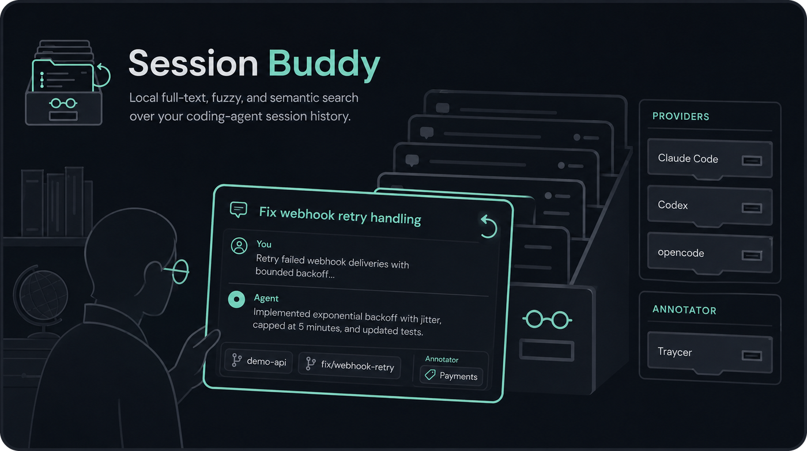
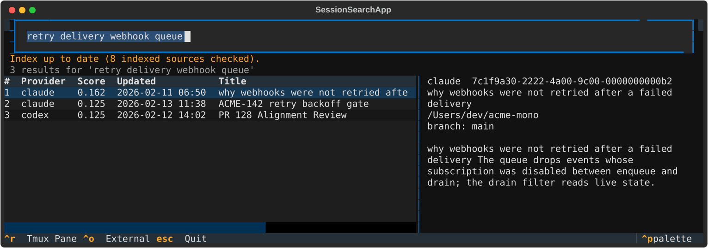

<p align="center">
  
</p>

## What It Looks Like

Search prints ranked hits with inline matched excerpts, so the answer is usually visible
without opening a transcript:

```console
$ sb "retry budget on a dead endpoint" --limit 2 --show-ext
 1. claude 0.650 2026-02-13 11:38 ACME-142 retry backoff gate
    cwd: /Users/dev/acme-mono
    id: 7c1f9a30-1111-4a00-9c00-0000000000a1
    branch: acme-142-retry-backoff
    updated: 2026-02-13 11:38 UTC
    traycer: agent_title=ACME-142 retry backoff gate epic_id=a1b2c3d4-0000-4000-8000-00000000ab01 epic_title=Payments Integration Analysis kind=agent workspace=/Users/dev/acme-mono
    match: gate delivery [on] the [retry] [budget] so [a] [dead] [endpoint] stops burning [attempts]
    match: gate delivery [on] the [retry] [budget] so [a] [dead] [endpoint] stops burning [attempts] [Added] isRetryBudgetAvailable to the delivery...

 2. codex  0.125 2026-02-12 14:02 PR 128 Alignment Review
    cwd: /Users/dev/acme-mono
    id: 019f0000-0000-7000-8000-000000000001
    branch: main
    updated: 2026-02-12 14:02 UTC
    traycer: chat_title=PR 128 Alignment Review epic_id=a1b2c3d4-0000-4000-8000-00000000ab01 epic_title=Payments Integration Analysis kind=chat workspace=/Users/dev/acme-mono
    match: review PR 128 (main...retry-backoff) for alignment with the delivery contract One defect: the backoff timestamp is recorded before the attempt, so a crash mid-attempt loses the retry.
```

`sb groups` lists what an orchestrator has grouped, newest first:

```console
$ sb groups
traycer  a1b2c3d4    3 sessions  Payments Integration Analysis
traycer  b7e4f091    1 sessions  Webhook Delivery Hardening
traycer  c93a1d55    0 sessions  Public API Docs Refresh
```

The count is sessions present in *this* index, so it reflects what a search can actually
reach — a group whose sessions were never indexed reads 0.

`--branch` finds sessions by the branches they touched, which is not the same as the branch
they started on:

```console
$ sb "amount threshold" --branch acme-142
 1. claude 0.648 2026-02-13 11:38 ACME-142 retry backoff gate
    branches: acme-142-retry-backoff (push), acme-142-retry-backoff (worktree), acme-155-other (start)
```

A session often creates or pushes a branch it did not start on, so the provider's own
`git_branch` answers the wrong question. Branches are read out of the transcript instead —
from push output, `worktree add`, `On branch`, and `checkout -b` — and each one records how it
was seen.

The TUI adds a preview pane and resume shortcuts:



## Supported Tools

| Tool | Role | Reads | Needs |
| --- | --- | --- | --- |
| Claude Code | provider — owns transcripts | `~/.claude/projects` | built in |
| Codex | provider — owns transcripts | `~/.codex/sessions`, `state_5.sqlite`, `session_index.jsonl` | built in |
| opencode | provider — owns transcripts | `~/.local/share/opencode/opencode.db` | built in |
| pi | provider — owns transcripts | `~/.pi/agent/sessions`, `~/.pi/profiles/*/sessions` | built in |
| Traycer | annotator — epic and agent titles for sessions it orchestrates | `~/.traycer/epics` | `[traycer]` extra |
| Conductor | annotator — workspace, branch and session names for sessions it runs | `~/Library/Application Support/com.conductor.app/conductor.db` | built in |

A **provider** owns a transcript and produces session rows. An **annotator** describes sessions
another tool owns — orchestrators and meta-harnesses live here, and a tool can be both. Adding
either is a file, not a schema change: see [docs/data-model.md](docs/data-model.md).

Only tools present on the machine are read; the rest are skipped silently.

## Install

Install the CLI on your PATH:

```sh
uv tool install git+https://github.com/domjancik/session-buddy
```

This installs two equivalent executables: `sb` and `session-buddy`.
The short form is used throughout this README.

For local development instead:

```sh
uv sync --extra test
```

For higher-quality local semantic embeddings, install the optional model stack:

```sh
uv sync --python 3.12 --extra test --extra semantic
sb index --force --semantic-backend sentence-transformers
```

Without the semantic extra, the tool still provides local semantic-style matching with deterministic hashed embeddings.

## Agent Skill

`skills/session-buddy/` is a skill so coding agents reach for this tool instead of hand-rolling a
grep over the raw transcript directories. One directory serves every harness — they all read the
same `SKILL.md` format.

```sh
git clone https://github.com/domjancik/session-buddy
cd session-buddy

# Claude Code
ln -s "$PWD/skills/session-buddy" ~/.claude/skills/session-buddy

# Codex (honours $CODEX_HOME, defaults to ~/.codex)
mkdir -p ~/.codex/skills && ln -s "$PWD/skills/session-buddy" ~/.codex/skills/session-buddy

# pi (per profile; or pass --skill <path> for a one-off)
mkdir -p ~/.pi/profiles/<profile>/skills \
  && ln -s "$PWD/skills/session-buddy" ~/.pi/profiles/<profile>/skills/session-buddy
```

Agents then pick it up on prompts like "find the session that reviewed PR 1234" or "did we
already investigate this?". Symlinking keeps it current with `git pull`.

**Restart your agent after linking** — skills load at session start, so a session already
running will not see it.

## Index Sessions

```sh
sb index
```

By default this scans:

- `~/.claude/projects`
- `~/.codex/sessions`
- `~/.codex/state_5.sqlite`
- `~/.codex/session_index.jsonl`
- `~/.local/share/opencode/opencode.db` (honours `$XDG_DATA_HOME`; override with `--opencode-home`)
- `~/.pi/agent/sessions` and `~/.pi/profiles/*/sessions` (override with `--pi-home`)

The index is stored at `~/.session-buddy/index.sqlite`, so every directory shares one index.
Override with `--db <path>` or the `SESSION_BUDDY_DB` environment variable.

## Keeping The Index Fresh

Indexing is not automatic on its own. Two pieces make it feel automatic:

**1. A shell alias** so every search refreshes stale sources first:

```sh
alias sb='command sb --auto-index'
```

`--auto-index` is accepted before the subcommand precisely so it can live in an alias.

**2. A Claude Code `SessionEnd` hook** so a transcript is indexed the moment it stops changing,
which keeps the alias cheap — there is usually nothing left to index. In `~/.claude/settings.json`:

```json
{
  "hooks": {
    "SessionEnd": [{
      "hooks": [{
        "type": "command",
        "command": "L=/tmp/sb-index.lock; [ -d \"$L\" ] && [ -z \"$(find \"$L\" -maxdepth 0 -mmin -10)\" ] && rmdir \"$L\" 2>/dev/null; mkdir \"$L\" 2>/dev/null || exit 0; trap 'rmdir \"$L\" 2>/dev/null' EXIT; sb index --prune >/dev/null 2>&1",
        "async": true,
        "timeout": 300
      }]
    }]
  }
}
```

Use an absolute path to `sb` — the hook does not inherit your interactive shell's `PATH`.
The `mkdir` lock keeps two sessions ending at once from writing the index concurrently, and
self-clears if a run dies holding it. `--prune` drops sessions whose transcripts were deleted by
Claude Code's retention policy; without it they linger in the index forever.

## Orchestrator Metadata (Traycer, Conductor, and later tools)

Tools that *run* agent sessions rather than author them — Traycer and Conductor today,
Omnigent-style meta-harnesses later — can attach metadata to sessions they orchestrate. Session Buddy calls
these **annotators**; see [docs/data-model.md](docs/data-model.md) for the model and how to add
one.

```sh
uv tool install "git+https://github.com/domjancik/session-buddy[traycer]"   # Traycer needs the extra
sb index          # annotations attach automatically for whichever tools are present
```

Conductor needs no extra — it stores its metadata in SQLite, which is built in.

Both fix the worst titles in the index, because an orchestrated session opens with whatever
the orchestrator injected rather than with what you asked. Traycer contributes epic and
per-agent titles; Conductor contributes the workspace, its branch, and the session name shown
in its UI — otherwise every session it has run is titled `<system_instruction> You are working
in…`.

```sh
sb "retry backoff" --show-ext              # show annotator metadata under each hit
sb "retry backoff" --ext traycer.epic_title=Payments   # scope to one epic
sb "migration" --ext traycer                  # only sessions Traycer orchestrated
sb "review" --ext conductor.workspace=acme-mono   # one Conductor worktree
sb groups                                     # list epics: id, session count, title
```

Without the extra installed, or with no such tool on the machine, everything above is simply
absent — indexing and search are unaffected.

## Index Status

```sh
sb status
```

Status reports new, changed, deleted, and unchanged session sources. A source is considered changed when its transcript file changes or when provider metadata changes, such as Claude `sessions-index.json` or Codex per-session thread/index metadata.

## Search

```sh
sb "webhook retry"                    # a bare query means search
sb search "webhook retry"             # explicit form
sb "acme-mono" --provider codex --limit 20
sb "routing" --auto-index
```

Search warns when the index is stale. Pass `--auto-index` to update changed sources and prune deleted index entries before searching.

## TUI

The terminal UI is built with Textual.

```sh
sb tui
sb tui --auto-index
sb tui --no-tmux
```

When `tmux` is available and the command is not already running inside tmux, `sb tui` starts a temporary tmux session automatically. That makes `Ctrl-R` pane resume available without manually starting tmux first. Pass `--no-tmux` to run the Textual UI directly.

The TUI shows an index-status banner on startup. Pass `--auto-index` to update changed sources and prune deleted index entries before opening the interface.

Keys:

- Type a query and press `Enter` to search.
- Use arrow keys to move through results.
- Press `Ctrl-R` to resume the selected session in a tmux split pane.
- Press `Ctrl-O` to resume the selected session externally in the normal terminal.
- Press `Ctrl-W` to restore the selected session's missing worktree when a restore command can be inferred.
- Press `Ctrl-P` to toggle preview.
- Press `Ctrl-U` to clear the query.
- Press `Esc` to quit.

Tmux-pane resume creates a real tmux pane with the selected agent command, so Claude/Codex owns that pane interactively. If tmux is not installed or the TUI is launched with `--no-tmux`, use `Ctrl-O` for external resume.

## Resume

```sh
sb resume 019eabd2-9955-77e0-8fd8-2927fbbd3cff          # provider inferred
sb resume codex 019eabd2-9955-77e0-8fd8-2927fbbd3cff    # explicit
sb resume claude 8a4837df-fda2-4e32-b612-2dacc03d8698
sb resume claude 8a4837df-fda2-4e32-b612-2dacc03d8698 --tmux-pane
```

Codex resumes with `codex resume -C <cwd> <session_id>`.
Claude resumes with `claude --resume <session_id>` from the indexed session folder.
opencode resumes with `opencode --session <session_id>` from the session's directory.
pi resumes with `pi --session <transcript path>` — the path, because `--session` also accepts a
partial uuid and those can collide.
If an indexed Codex folder no longer exists, resume falls back to the current directory and prints a warning.
If an indexed Claude folder no longer exists, resume prints a restore command when the missing path is under a repo `.worktrees` folder, for example:

```sh
git -C /Users/example/dev/acme-mono worktree add /Users/example/dev/acme-mono/.worktrees/84-teal 84-teal
```

Claude resume is project-directory scoped, so restore the original folder before running `claude --resume`.
Pass `--tmux-pane` to open the same prepared command in a tmux split pane instead of the current terminal.
